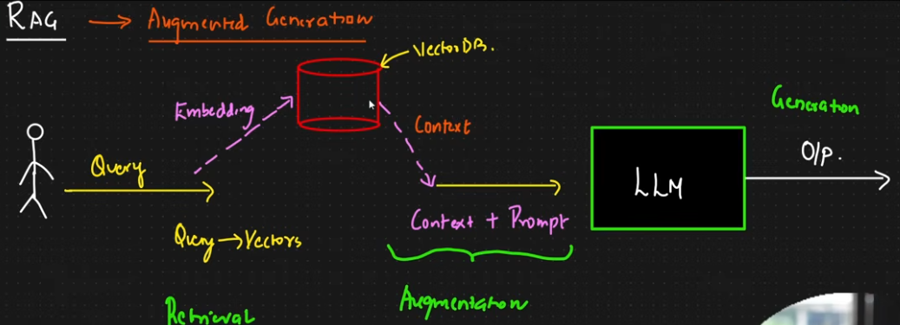

# 📚 RAG Document Q&A — Chat with Your PDFs

A complete **Retrieval-Augmented Generation (RAG)** application: upload any PDF, ask questions in plain English, and get answers grounded in the document — with page-level citations and similarity scores for every source.

Built with **LangChain · ChromaDB · SentenceTransformers · Groq · Streamlit**.



## ✨ Features

- **📄 PDF ingestion** — upload one or more PDFs; text is extracted page by page with PyMuPDF
- **✂️ Smart chunking** — recursive character splitting with tunable chunk size and overlap, so context isn't lost at chunk boundaries
- **🧠 Semantic search** — chunks are embedded with `all-MiniLM-L6-v2` (384-dim vectors) and stored in a persistent ChromaDB collection using cosine similarity
- **⚡ Fast, grounded answers** — Groq's Llama 3.3 70B answers using *only* the retrieved context, dramatically reducing hallucinations
- **🔍 Transparent citations** — every answer shows the exact source chunks, page numbers, and similarity scores. No black box.
- **🎛️ Tunable retrieval** — adjust top-k, chunk size, and overlap live from the sidebar and see how retrieval quality changes

## 🏗️ How It Works

```
PDF upload → PyMuPDF text extraction → recursive chunking
→ SentenceTransformer embeddings → ChromaDB vector store
→ cosine similarity search → Groq LLM answer with cited sources
```

**Data ingestion pipeline:**


**Full RAG pipeline:**


## 🚀 Quickstart

**1. Clone and install** (using [uv](https://docs.astral.sh/uv/) — recommended):

```powershell
git clone https://github.com/NiazUMahmud/RAG-Portfolio-Projects.git
cd RAG-Portfolio-Projects
uv sync
```

Or with plain pip:

```powershell
python -m venv .venv
.\.venv\Scripts\Activate.ps1
pip install -r requirements.txt
```

**2. Add your Groq API key** (free at [console.groq.com](https://console.groq.com)) — create a `.env` file in the project root:

```
GROQ_API_KEY=your_key_here
```

**3. Run the app:**

```powershell
uv run streamlit run app.py
```

**4. Use it** — upload a PDF in the sidebar, click **Ingest uploaded PDFs**, then ask questions in the chat.

> Try it with the included [Attention Is All You Need](data/notebook/data/pdf/) paper — ask *"What is multi-head attention?"* and watch it answer with the formula, citing page 5. 🎯

## 🧰 Tech Stack

| Component | Technology |
|---|---|
| UI | Streamlit (chat interface, live settings) |
| PDF parsing | PyMuPDF |
| Chunking | LangChain `RecursiveCharacterTextSplitter` |
| Embeddings | SentenceTransformers (`all-MiniLM-L6-v2`) |
| Vector store | ChromaDB (persistent, cosine similarity) |
| LLM | Groq — Llama 3.3 70B / Llama 3.1 8B |
| Environment | Python 3.13 · uv |

## 📁 Project Structure

```
├── app.py                      # Streamlit RAG app (the main deliverable)
├── data/notebook/
│   ├── document.ipynb          # Notebook: ingestion → embeddings → vector store
│   └── data/pdf/               # Sample PDFs for testing
├── pdf_loader.ipynb            # Notebook: retriever pipeline experiments
├── typesense.ipynb             # Notebook: Typesense as an alternative vector store
├── pyproject.toml              # Dependencies (uv)
└── requirements.txt            # Dependencies (pip)
```

The notebooks document the learning journey — building each pipeline stage by hand (document loaders, embedding manager, vector store wrapper, retriever) before assembling them into the polished app.

## 💡 Key Lessons Learned

- **Chunking strategy matters more than you'd think** — chunk size and overlap directly change retrieval quality
- **Cosine vs. L2 distance is not a detail you can ignore** — ChromaDB defaults to L2; converting distance to a similarity score only makes sense once the collection is configured for cosine (`hnsw:space: cosine`)
- **Grounding the LLM** with "answer only from the provided context" plus explicit source citations makes answers verifiable and cuts hallucinations

## 🔐 Security

API keys are loaded from `.env` (git-ignored) — never committed to source control. Generated vector stores are also git-ignored and rebuilt by re-ingesting PDFs.

---

*Part of my RAG portfolio series. Questions or feedback welcome — [connect with me on LinkedIn](https://www.linkedin.com/).*
